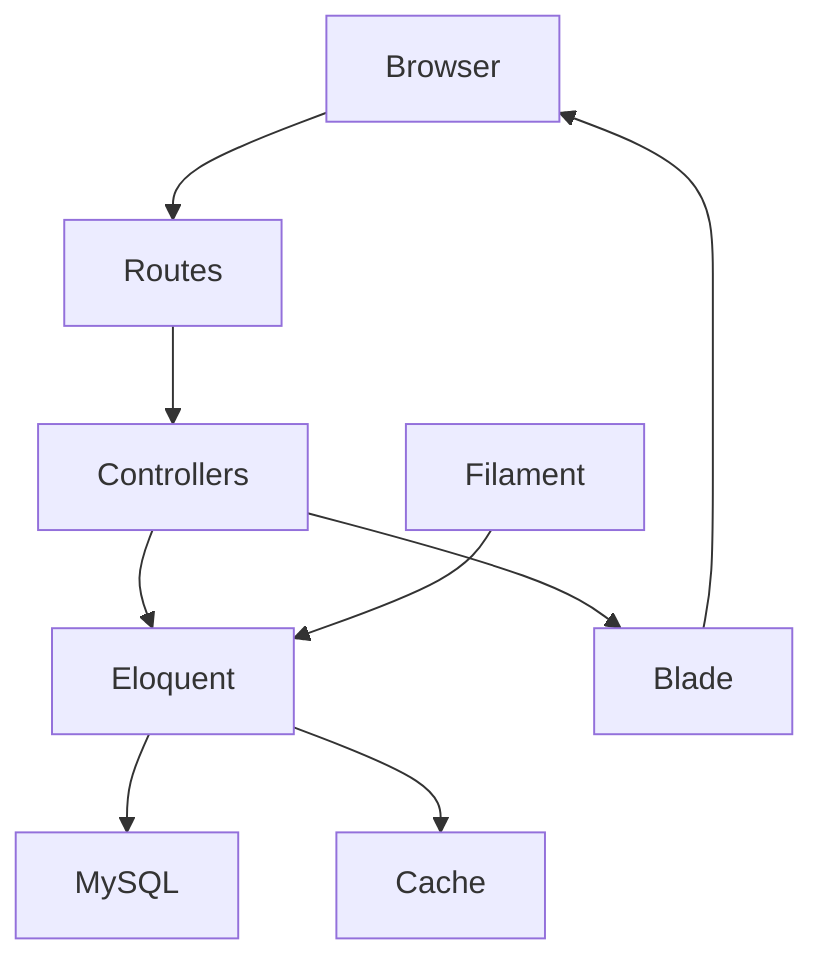

# Requirements

### Overview & Goals
Complete PhoneSpecs as a production-ready public phone-specification and news site while preserving its existing Bootstrap visual DNA. Reference websites are used only for information hierarchy and discovery patterns; no branding, copied styling, typography, icons, layouts, or assets will be introduced.

### Scope
#### In scope
- Finish the shared responsive shell: dark primary navbar, light category navigation, centered desktop content shell, footer, cookie notice, and accessible mobile behavior.
- Deliver the public browsing journeys: homepage discovery, device directory, brand-filtered directory, status filtering, device detail/specification browsing, device search, device comparison, news listing, news detail, privacy, and terms.
- Keep the existing visual language: Bootstrap cards/tables/buttons, neutral gray backgrounds, white content blocks, restrained blue accents, and simple typography.
- Make filtering, pagination, comparison selection, metadata, empty states, image fallbacks, and responsive layouts production-safe.
- Polish the existing Filament administration for brands, devices, device specifications, news posts, and device importing without changing dependencies.
- Preserve and improve SEO, accessibility, security headers, query efficiency, and cache invalidation using existing Laravel patterns.

#### Out of scope
- Copying any reference site’s identity or visual assets.
- Replacing Bootstrap-compatible styling with Tailwind or a new frontend framework.
- User accounts, favorites, comments, payments, or a public API.
- New third-party dependencies unless separately approved.
- Custom advertisement design, ad-slot layout, or manual ad placement; Google will manage automatic ads separately.

### Acceptance Criteria
- Every public route in `routes/web.php` renders correctly on desktop and mobile and uses named-route links.
- Brand and status filters preserve query state through pagination and produce useful empty states.
- Search validates short/long input, returns safe JSON, and displays accessible results without uncaught browser errors.
- Compare accepts the UI’s selected-device format, limits selection to four valid devices, handles missing/invalid IDs, and renders a responsive table.
- Device and news pages have consistent image sizing/fallbacks, escaped content, metadata, canonical URLs, and clear navigation.
- Admin-managed content is reflected in public pages without stale homepage data.
- No reference-site branding or copied visual assets appear in the implementation.

### Production Quality
- Use eager loading and bounded/paginated queries for public pages.
- Keep user-controlled values validated and constrained at the controller/request boundary.
- Maintain secure response headers and escaped Blade output.
- Ensure layout shifts are minimized by fixed image regions and provide meaningful alt text and labels; Google automatic ads remain outside the application-owned layout.

# Technical Design

### Current Implementation
- `routes/web.php` defines public routes for home, devices, search, news, compare, and legal pages.
- `HomeController@index` already caches homepage IDs for ten minutes and reloads ordered `Device`, `NewsPost`, and `Brand` records.
- `DeviceController@index` eager-loads `brand`, supports `brand` and `status` filtering, and paginates twelve devices; `show` eager-loads `brand` and `specs`; `search` returns up to eight JSON matches with throttling.
- `CompareController@index` loads up to four IDs from the comma-separated `devices` parameter, while `resources/views/compare/index.blade.php` currently submits `device_ids[]`; these contracts must be unified.
- `resources/views/layouts/app.blade.php` is the shared shell and contains the primary/category navigation, search dropdown, cookie notice, SEO tags, and Vite assets; its application-owned ad placeholder must be removed.
- `resources/css/app.css` and the existing Blade views already establish the current Bootstrap card, grid, detail, comparison, and article styling.
- Filament resources under `app/Filament/Resources` manage brands, devices, device specs, and news posts; `app/Filament/Imports/DeviceImporter.php` supports device import.

### Key Decisions
- **Server-rendered Blade remains the page architecture:** keep controllers responsible for data preparation and views responsible for presentation; use the existing lightweight JavaScript only for header search and cookie consent.
- **Existing Bootstrap DNA remains the design system:** extend `resources/css/app.css` and existing view classes rather than adding Tailwind, a component framework, or a new visual theme.
- **Comparison uses one canonical query contract:** standardize the selector and controller around a bounded list of device IDs, normalize/validate values, and retain named-route GET navigation for shareable comparison URLs.
- **Existing cache strategy is retained:** continue caching the homepage ID lists and invalidate the existing cache key from content models/import flows when relevant records change.
- **No new dependency is required:** use Laravel 13, existing Eloquent, Blade, Vite, and Filament 5 APIs.

### Proposed Changes
- Refine `resources/views/layouts/app.blade.php` and `resources/css/app.css` for consistent shell widths, navigation active states, mobile collapse behavior, keyboard-accessible search results, focus states, and safe handling when optional DOM elements are absent; remove the application-owned ad markup and `.ad-placeholder` styles.
- Complete `resources/views/home.blade.php` as the primary discovery dashboard: brand finder, latest devices, latest news, featured content, and responsive sidebar/main-column behavior using reusable existing card patterns.
- Complete `DeviceController@index` and `resources/views/devices/index.blade.php` for brand/status filters, selected-brand context, reset links, pagination query preservation, release/status metadata, image fallbacks, and empty states. Include only relevant filter parameters in canonical metadata.
- Keep `DeviceController@show` and `resources/views/devices/show.blade.php` focused on a readable device summary, compare/more-brand actions, grouped specification tables, missing-spec handling, and device metadata/schema where supported by existing conventions.
- Align `CompareController@index` with the compare form, normalize selected IDs, preserve device ordering where practical, avoid loading an unbounded device selector as the dataset grows, and update `resources/views/compare/index.blade.php` with clear selection state, validation feedback, responsive overflow, and missing-value presentation.
- Harden `DeviceController@search` and the inline search behavior in `resources/views/layouts/app.blade.php`: consistent URL generation, request cancellation/stale-response protection, accessible result announcements, outside-click/keyboard behavior, safe empty/error states, and bounded eager-loaded results.
- Finish `NewsController`, `resources/views/news/index.blade.php`, and `resources/views/news/show.blade.php` with published-only behavior, stable image ratios/fallbacks, escaped article bodies, pagination, canonical/Open Graph metadata, and clear back-navigation.
- Review `app/Models/Brand.php`, `app/Models/Device.php`, `NewsPost`, and related models for explicit relationship return types, casts, cache invalidation, and indexes/constraints already represented by the database schema; avoid redundant model helpers where controller loading already supplies the data.
- Polish the existing Filament schemas/tables/pages under `app/Filament/Resources/**` so editorial fields, statuses, image uploads, relationships, sorting, and import errors are clear and consistent with the public data contract.

### File Structure
#### Likely modified
- `routes/web.php`
- `app/Http/Controllers/HomeController.php`
- `app/Http/Controllers/DeviceController.php`
- `app/Http/Controllers/CompareController.php`
- `app/Http/Controllers/NewsController.php`
- `app/Models/Brand.php`, `app/Models/Device.php`, and related content models as needed
- `resources/views/layouts/app.blade.php`
- `resources/views/home.blade.php`
- `resources/views/devices/index.blade.php`
- `resources/views/devices/show.blade.php`
- `resources/views/compare/index.blade.php`
- `resources/views/news/index.blade.php`
- `resources/views/news/show.blade.php`
- `resources/css/app.css` (remove obsolete custom ad-placeholder rules while retaining the PhoneSpecs design system)
- `resources/js/app.js` if shared client behavior is moved out of the layout
- relevant files under `app/Filament/Resources/**` and `app/Filament/Imports/**`
- `tests/Feature/PublicBrowsingTest.php` and additional focused feature tests if needed

#### Only if required by the existing schema review
- targeted migration files for missing indexes/constraints, with no destructive changes

### Architecture Flow

### Risks & Mitigations
- **Compare parameter mismatch:** define one request format and test both valid and malformed selections.
- **N+1 queries:** retain `with()`/`load()` for brand/spec relationships and verify bounded query paths.
- **Stale homepage cache:** preserve model/import invalidation and test updated content visibility after cache changes.
- **Large selector datasets:** keep the initial implementation bounded and identify a future searchable selector without adding it prematurely.
- **Responsive regressions:** verify narrow mobile, tablet, and desktop breakpoints for every grid/table/card view; leave automatic ad rendering to Google.
- **SEO duplication:** generate canonical URLs that reflect meaningful filters while avoiding unstable query noise.
- **Unsafe content:** continue escaped Blade rendering for news bodies and validate upload/input boundaries in admin flows.

# Testing

### Validation Approach
- Use PHPUnit feature tests following the existing `tests/Feature/PublicBrowsingTest.php` style and `RefreshDatabase` setup.
- Run focused tests after each related implementation slice, then run the complete suite with `php artisan test --compact`.
- Build frontend assets with `npm run build` and confirm the Vite manifest is usable by the Blade layout.
- Exercise the rendered public routes at desktop and mobile breakpoints, including keyboard navigation, empty/error states, and pages after custom ad removal.

### Key Scenarios
- Homepage loads cached latest devices, news, and brands with eager-loaded relationships.
- Device listing filters independently and together by brand and status; pagination preserves filters; reset clears them.
- Unknown brand, invalid status, no matching devices, missing images, missing release dates, and devices with no specs render safely.
- Search rejects one-character queries, trims/limits long input, returns matching device/brand results, handles no results, and links to valid device pages.
- Compare accepts the form’s selected values, limits to four valid unique devices, ignores invalid/nonexistent IDs, preserves selected devices, and renders missing spec values correctly.
- News index excludes unpublished posts, paginates, handles missing images, and links to escaped article detail pages.
- News detail escapes script-like content and returns expected security headers and metadata.
- Mobile navigation, search dropdown, cookie banner, tables, and grids remain usable without horizontal layout breakage except intentional responsive table scrolling; no custom ad UI is introduced.
- Filament create/edit/import flows retain valid relationships, statuses, image handling, and cache freshness.

### Regression Checks
- Confirm all named routes resolve and no hard-coded route path breaks local or production prefixes.
- Confirm image URLs and storage fallbacks do not expose unsafe user-provided markup.
- Confirm cache keys are invalidated after device, brand, and news changes where homepage data is affected.
- Re-run formatter for changed PHP with `vendor/bin/pint --dirty --format agent`; report the existing optional Fontaine build warning without adding a dependency.

# Delivery Steps

###   Step 1: Complete the first UX presentation slice — completed
The first Bootstrap-DNA presentation slice is complete for device details, comparison presentation, and news presentation across desktop and mobile.

- Delivered the structured device detail header, image fallback, status/release metadata, comparison action, grouped specification tables, and responsive table treatment in `resources/views/devices/show.blade.php` and `resources/css/app.css`.
- Delivered the comparison selection panel, comparison guidance, responsive comparison table container, and empty-selection state in `resources/views/compare/index.blade.php` and `resources/css/app.css`.
- Delivered the news listing/detail card hierarchy, image treatment, article spacing, escaped body rendering, and back navigation in `resources/views/news/index.blade.php`, `resources/views/news/show.blade.php`, and `resources/css/app.css`.
- Preserved the existing Bootstrap cards, spacing, colors, and typography; no custom advertisement UI was added.
- Treat backend contract hardening, validation, cache checks, and automated regression coverage as remaining work in the next phases.

###   Step 2: Fix and productionize comparison and search — next
Search and compare become shareable, bounded, accessible workflows with one consistent request contract.

- Align `resources/views/compare/index.blade.php` and `CompareController@index` on the selected-device query format.
- Normalize IDs, enforce the four-device limit, handle invalid and nonexistent selections, preserve valid selection state, and render responsive comparison tables.
- Harden `DeviceController@search` and the shared search behavior in `resources/views/layouts/app.blade.php` or `resources/js/app.js` for bounded input, throttling, stale responses, keyboard interaction, and no-result/error states.
- Add feature coverage for valid, invalid, duplicate, over-limit, and form-submitted comparison selections plus search edge cases.

###   Step 3: Finish news and administration quality — next
News publishing and Filament editorial workflows produce consistent public content and maintain correct content lifecycle behavior.

- Complete `NewsController`, `resources/views/news/index.blade.php`, and `resources/views/news/show.blade.php` for published-only listing, pagination, metadata, stable image fallbacks, escaped article content, and navigation.
- Review the existing Filament resources under `app/Filament/Resources/**` and `app/Filament/Imports/DeviceImporter.php` for validation, statuses, relationships, uploads, sorting, and import error handling.
- Ensure device, brand, and news mutations invalidate affected homepage cache data without introducing dependencies or a second admin architecture.

###   Step 4: Run production validation and regression coverage — next
The complete PhoneSpecs public experience passes automated, asset, security, accessibility, and responsive checks with no application-owned ad components.

- Extend `tests/Feature/PublicBrowsingTest.php` or add focused PHPUnit feature tests for all acceptance and regression scenarios.
- Run the narrowest relevant tests during each implementation slice, followed by `php artisan test --compact`.
- Run `vendor/bin/pint --dirty --format agent` for changed PHP and `npm run build` for frontend assets.
- Verify named routes, mobile/desktop layouts, SEO output, escaped content, security headers, cache freshness, and the absence of custom ad markup or placeholder styling; report only the known optional build warning.